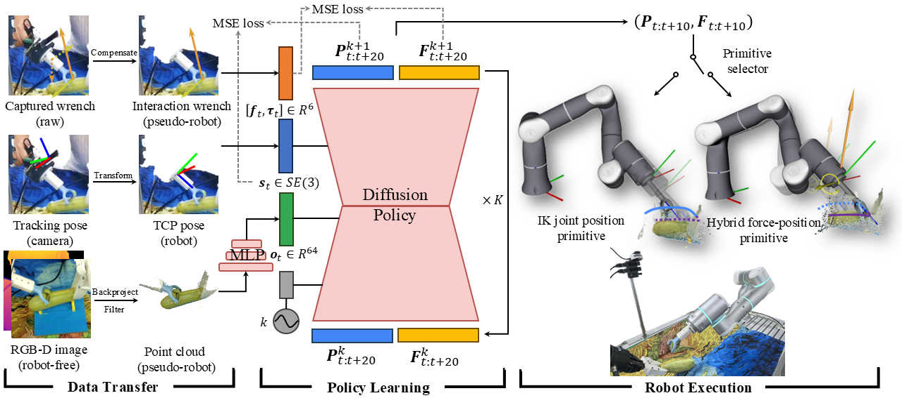

# HybridIL

<a href='https://forcemimic.github.io/'>
  
</a>
<a href='https://arxiv.org/abs/2410.07554'>
  
</a>
<a href='https://2025.ieee-icra.org'>
  
</a>
<br/>

<!--  -->


Official implementation for HybridIL in the paper [ForceMimic: Force-Centric Imitation Learning with Force-Motion Capture System for Contact-Rich Manipulation](https://arxiv.org/abs/2410.07554), accepted by [ICRA 2025](https://2025.ieee-icra.org).

For more information, please visit our [project website](https://forcemimic.github.io/).

---

## Installation
```bash
git clone git@github.com:ForceMimic/hybridil.git
cd hybridil

conda create -n hil python=3.8
conda activate hil

# for policy training
pip install -r train_requirements.txt
pip install -e .

# for real robot evaluation
pip install -r eval_requirements.txt
# download flexiv rdk v0.9.1 from https://github.com/flexivrobotics/flexiv_rdk
```

## Data Preparation
Please refer to [ForceCapture](https://github.com/ForceMimic/forcecapture) to collect and process the data.

## Policy Training
```bash
python train.py --config configs/train_dp_ftout.json
```

## Robot Evaluation
```bash
python node.py --config configs/eval_dp_ftout.json
python eval.py --config configs/eval_dp_ftout.json
```

---

## Acknowledgement
Our policy implementation is based on [DexCap](https://github.com/j96w/DexCap), [robomimic](https://github.com/ARISE-Initiative/robomimic) and [Diffusion Policy](https://github.com/real-stanford/diffusion_policy). Kudos to the authors for their amazing contributions.

## Citation
If you find our work useful, please consider citing: 
```bibtex
@inproceedings{liu2025forcemimic,
  author={Liu, Wenhai and Wang, Junbo and Wang, Yiming and Wang, Weiming and Lu, Cewu},
  booktitle={2025 IEEE International Conference on Robotics and Automation (ICRA)}, 
  title={ForceMimic: Force-Centric Imitation Learning with Force-Motion Capture System for Contact-Rich Manipulation}, 
  year={2025}
}
```

## License
This repository is released under the [MIT](https://mit-license.org/) license.
